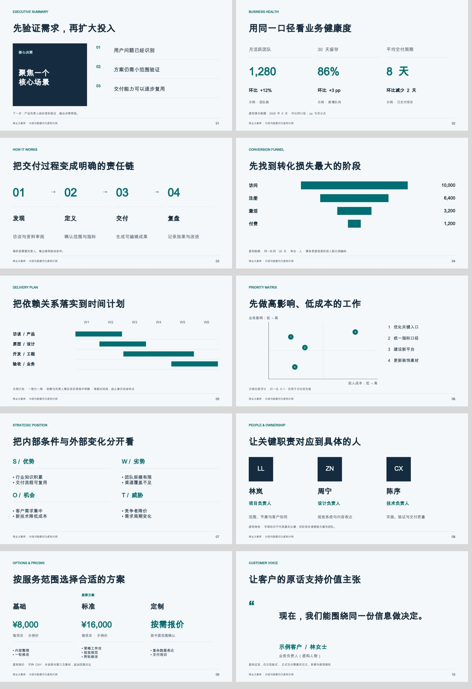
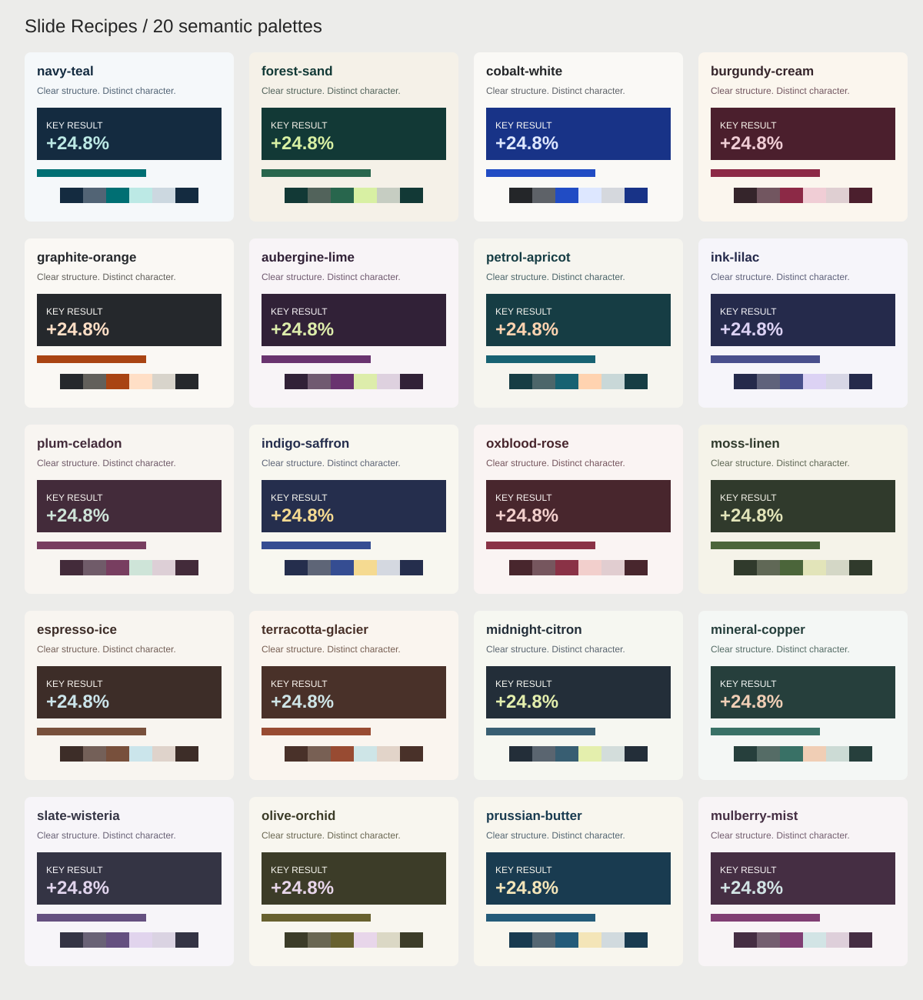
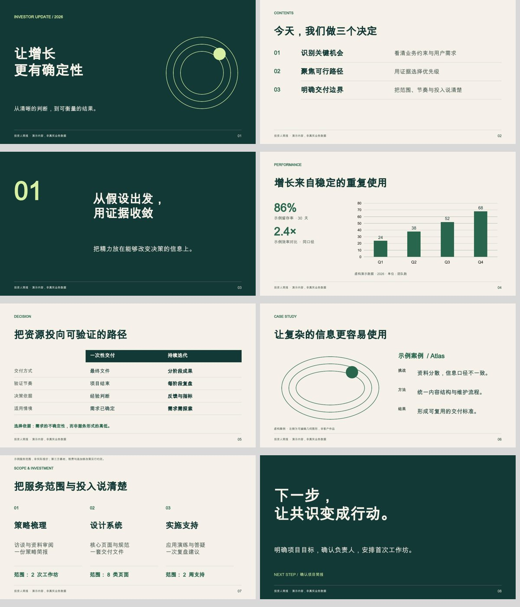
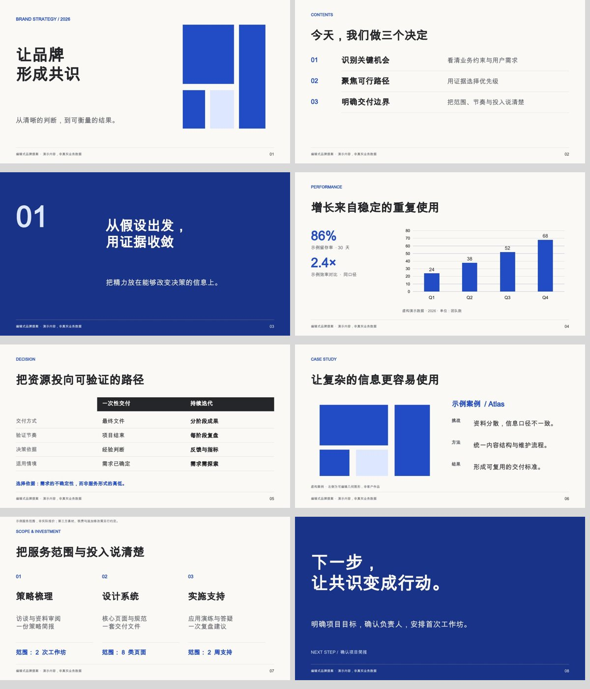
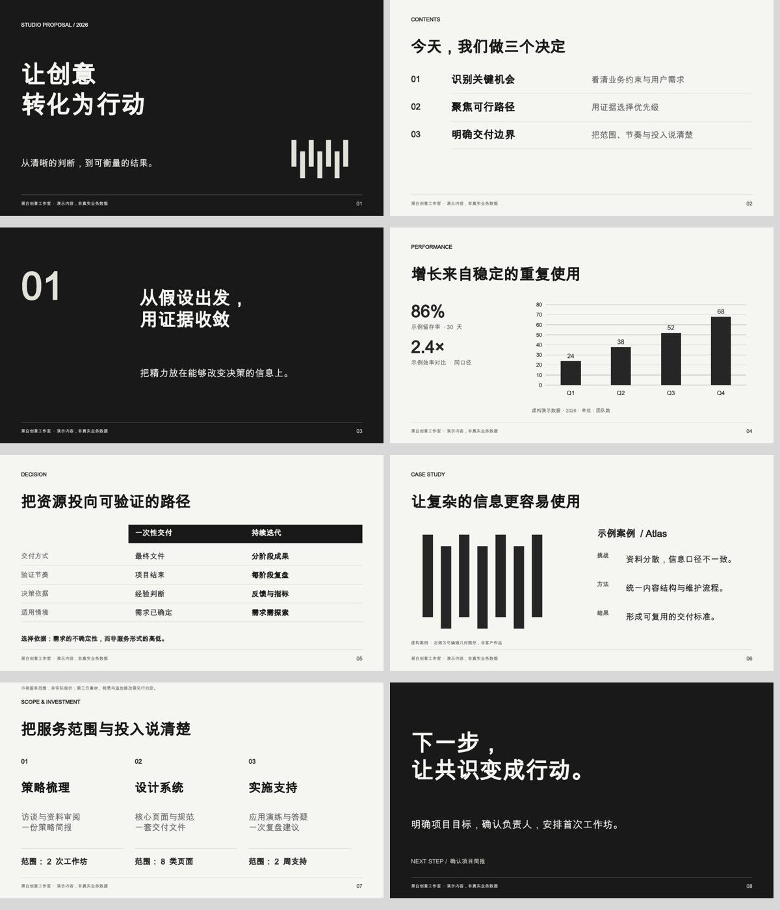

# Slide Recipes · 商业演示配方库

[English](README.md) | **简体中文**

[提示词指南](#prompt-guide) · [配色提示词](#color-guide) · [商业元素 API](skills/themed-cn-pptx/references/business-elements.md)

<p align="center">
  
</p>

<p align="center">
  <a href="LICENSE"></a>
  <a href="https://github.com/CacinieP/slide-recipes/actions/workflows/ci.yml"></a>
  
  
  
</p>

用 PptxGenJS 生成并**验收**真实、**可编辑、适配中文排版的 PPTX** 的开源技能合集 —— 由一道确定性 QA 门禁把关，而非肉眼。

首个技能 [`themed-cn-pptx`](skills/themed-cn-pptx/) 内置九套**审美 recipe**（短简报与完整商业提案）、provider 感知的 AI 配图层（OpenAI GPT Image 2 / Google Nano Banana Pro），以及三个 QA 工具（渲染 QA、CJK 溢出、可编辑性检查）。

---

## 🎬 演示画廊

三套锁定 demo，全部本仓库生成，**无需任何 API key**（纯色/发丝线占位回退）。下图用 LibreOffice 150 DPI 渲染。

| 演示 | 页数 | 配方 | 风格 |
| --- | --- | --- | --- |
| **Miku** | 3 | `miku`（技能展示） | 青粉撞色，明暗交替 |
| **Editorial Grid** | 6 | `recipe-editorial-grid.mjs` | Nord 中性色，发丝线报告风 |
| **Dark Launch** | 5 | `recipe-dark-launch.mjs` | 深底大字，白框二维码收尾 |

### Miku —— 技能展示

<p align="center">
  <a href="docs/img/demos/miku/miku-slide-1.jpg"></a>
  &nbsp;
  <a href="docs/img/demos/miku/miku-slide-2.jpg"></a>
  &nbsp;
  <a href="docs/img/demos/miku/miku-slide-3.jpg"></a>
</p>

### Editorial Grid —— 编辑报告风

<p align="center">
  <a href="docs/img/demos/editorial/editorial-slide-1.jpg"></a>
  <a href="docs/img/demos/editorial/editorial-slide-2.jpg"></a>
  <a href="docs/img/demos/editorial/editorial-slide-3.jpg"></a>
  <a href="docs/img/demos/editorial/editorial-slide-4.jpg"></a>
  <a href="docs/img/demos/editorial/editorial-slide-5.jpg"></a>
  <a href="docs/img/demos/editorial/editorial-slide-6.jpg"></a>
</p>

### Dark Launch —— 发布收尾风

<p align="center">
  <a href="docs/img/demos/darklaunch/darklaunch-slide-1.jpg"></a>
  <a href="docs/img/demos/darklaunch/darklaunch-slide-2.jpg"></a>
  <a href="docs/img/demos/darklaunch/darklaunch-slide-3.jpg"></a>
  <a href="docs/img/demos/darklaunch/darklaunch-slide-4.jpg"></a>
  <a href="docs/img/demos/darklaunch/darklaunch-slide-5.jpg"></a>
</p>

> `.pptx` 源文件已提交在 `examples/slides/output/`，可直接用 PowerPoint 打开编辑。

---

## ✨ 核心亮点

- **可编辑 PPTX** —— 输出真实 `.pptx`，非整页图片；由 `pptx-editable-check.py` 验证。
- **中文排版优先** —— 字体回退、全角符号、保守字号；溢出在渲染前预测。
- **渲染 QA 门禁** —— `render-qa.mjs` 捕捉溢出、遮挡、越界、比例错误、缺页码 badge。
- **锁定配方** —— 九套 recipe，统一排版规则并按信息关系选页。
- **供应商感知 AI 配图** —— OpenAI-compatible、Google/Nano、百炼同步 API、MiniMax，可自定义 endpoint 与模型 ID。
- **WCAG 色彩 QA** —— sRGB 亮度对比，非肉眼；CI 门禁遇 P0 即失败。
- **优雅降级** —— 没有 API key？纯色占位继续生成，绝不崩溃。

---

## 🚀 快速开始

```bash
git clone https://github.com/CacinieP/slide-recipes.git
cd slide-recipes
npm ci          # 安装锁定依赖
npm test        # skill manifest + smoke + 预置色板对比度 QA
npm run demos   # 一次构建全部三套 demo（无需 key）
```

然后把下面这段发给有 shell 权限的 Agent：

```text
帮我把这份 README 做成可编辑中文 PPTX，约 8 页，editorial-grid 配方。
```

**或直接安装技能：**

```bash
npx skills add https://github.com/CacinieP/slide-recipes --skill themed-cn-pptx
```

> 安装后即为自包含：`SKILL.md`、`lib/`、`recipes/`、`references/` **以及渲染 QA 门禁（`scripts/`）**一起随技能安装，所以在 `~/.agents/skills/themed-cn-pptx/`（或 `~/.pi/agent/skills/`、`.claude/skills/`）里直接用 `/skill:themed-cn-pptx` 就能跑 `render-qa`、`cjk-overflow-check`、`color-qa`、`pptx-editable-check`，不需要 clone 本仓库。只有生成 deck 需要的 `pptxgenjs` 仍要在你自己的工程里 `npm i`。标准 `pptx` skill（Anthropic 出品）只是**可选搭配**而非依赖——它的许可禁止再分发，所以本仓库刻意不代为打包，需要请自行从官方渠道获取。

---

<a id="prompt-guide"></a>

## 提示词指南：从需求到商业 PPT

直接复制下面的提示词，并替换方括号。信息充分时，技能会完成页级规划、构建和 QA；不用先单独要求“列大纲”。
描述清楚 **受众、用途、材料、页数、展示方式、视觉方向、交付格式**，比只说“高端、大气、商业级”更有效。

### 1. 一次生成完整提案

```text
使用 themed-cn-pptx，把[材料路径/粘贴内容]做成 12 页中文商业提案。
受众：[客户管理层]；目的：[批准试点]；演讲时间：[15 分钟]；场景：[会议投影]。
使用 editorial-proposal，配色 navy-teal。每页标题写成一个明确结论。
内容包括：执行摘要、客户问题、方案、流程、证据、案例、时间计划、团队、服务范围、报价、下一步。
只使用材料中的事实。缺少数据写“待补充”，不能虚构客户、业绩或证言。
图表保留原生可编辑数据；正文不能整页图片化。无必要不生成装饰图。
先完成页级规划，再直接生成 PPTX、构建源码和预览，并完成渲染检查。
```

### 2. 经营复盘：指定商业元素

```text
把[数据表路径]做成 10 页月度经营复盘，受众是业务负责人。
使用 investor-signal + forest-sand。包含 KPI 看板、同队列转化漏斗、
问题优先级矩阵、下月甘特计划，以及一页明确的管理决策。
KPI 显示当前值、对比期、变化和统计口径；区分百分比与百分点。
漏斗只用可比较的同一队列数据；矩阵说明评分依据。
标明数据时间、单位和来源，不将缺失数据默认为零。
```

### 3. 只改指定页，保留事实与图表

```text
修改[已有 PPTX 与构建脚本路径]：
将第 4 页改为 KPI 看板，第 6 页改为双方案对比，第 8 页改为甘特图。
其他页面保留原文与布局；所有数值、来源和引用保持不变。
延续原字体与配色。空间不足时拆页，不把正文缩成小字。
输出修改后的 PPTX、源码以及本次改动清单。
```

### 4. 配图与真实素材

```text
只为封面和章节页生成概念配图；案例页使用我提供的真实产品图片。
图像采用[哑光材料/摄影/抽象线条]，统一[光线、色温、视角]。
封面右侧主体，左侧 45% 保持低细节留白；无文字、Logo、数字、二维码。
使用我已配置的[provider / endpoint / model]，密钥从环境读取。
保持标题、数据图表和标签为可编辑 PPT 对象；缺少素材或生成失败时说明。
```

### 可直接点名的商业元素

三套商业 recipe 现在包含原有 8 类页面 + 新增 10 类商业元素，共 **18 类页面/元素 API**。

| 提示词中的名称 | API | 适用 |
| --- | --- | --- |
| 执行摘要 | `executiveSummary` | 决策、证据、下一步 |
| KPI 看板 | `kpiDashboard` | 3–4 个指标与对比口径 |
| 流程链 | `processFlow` | 3–4 个阶段与输出 |
| 转化漏斗 | `funnel` | 3–5 个递减阶段，宽度按实际数值编码 |
| 甘特计划 | `gantt` | 4–8 个等距时间段、3–5 项任务 |
| 优先级矩阵 | `quadrant` | 影响/投入等两维评分，0–1 坐标 |
| SWOT | `swot` | 内部优势劣势、外部机会威胁 |
| 团队与职责 | `team` | 2–3 人，真实头像或字母标识 |
| 套餐报价 | `pricing` | 2–3 方案，币种、计价周期、包含项 |
| 客户证言 | `testimonial` | 真实原话、署名、来源 |



完整字段与数据限制见 [商业元素 API](skills/themed-cn-pptx/references/business-elements.md)。运行 `npm run demo:elements` 查看 10 页示例。

<a id="color-guide"></a>


### 15 套小众配色：从气质到可执行色板



保留原有 5 套，共 20 套。以下为原创组合，场景仅供选择；每套都有完整的 8 个语义角色，正文相关色对均通过 4.5:1 校验。鲜亮的第二色用于 highlight，在深底上强调，不能随意替代浅底正文色。

| 预设 | 气质 / 适用场景 | 主强调 / 第二色 |
|---|---|---|
| `aubergine-lime` | 茄紫青柠 · 品牌战略 / 创意提案 | `69336F` / `DDEDAB` |
| `petrol-apricot` | 孔雀蓝杏桃 · 消费品牌 / 客户成功 | `176272` / `FFD3B0` |
| `ink-lilac` | 墨蓝丁香 · 研究洞察 / 文化科技 | `494F8C` / `DCD2F4` |
| `plum-celadon` | 梅子青瓷 · 高端服务 / 生活方式 | `783E60` / `CEE4D8` |
| `indigo-saffron` | 靛青藏红花 · 产品发布 / 学术创新 | `354D92` / `F5DA91` |
| `oxblood-rose` | 牛血红雾粉 · 精品零售 / 品牌复盘 | `8A3246` / `F2CFCC` |
| `moss-linen` | 苔藓亚麻 · 建筑 / 可持续发展 | `4B653A` / `E2E4B9` |
| `espresso-ice` | 浓缩咖啡冰蓝 · 咨询 / 精品酒店 | `78503C` / `CBE5EB` |
| `terracotta-glacier` | 赤陶冰川 · 文旅 / 空间设计 | `984B32` / `CEE5E7` |
| `midnight-citron` | 午夜香橼 · 数字产品 / 增长策略 | `385E72` / `E4EFAD` |
| `mineral-copper` | 矿石铜锈 · 工业设计 / 制造业 | `397166` / `F0CEB5` |
| `slate-wisteria` | 板岩藤紫 · 人力组织 / 专业服务 | `655080` / `E1D4ED` |
| `olive-orchid` | 橄榄兰花 · 艺术商业 / 美妆企划 | `68612F` / `E8D6EA` |
| `prussian-butter` | 普鲁士蓝奶油 · 金融叙事 / 出版策划 | `245B79` / `F4E5B8` |
| `mulberry-mist` | 桑葚薄雾 · 文化展览 / 客户体验 | `803E73` / `D2E4E5` |

```text
为这份 [行业/主题] PPT 提供 3 个有辨识度的配色方向：
A aubergine-lime（茄紫青柠），B petrol-apricot（孔雀蓝杏桃），
C espresso-ice（咖啡冰蓝）。先用同一页 KPI 仪表盘比较，再选一套应用全稿。
必须输出 paper/ink/muted/accent/highlight/line/dark/light 的 HEX 值。
浅色大底占约 70–80%，结构与文字用深色，彩色强调只用于关键结论。
标题、正文、图表沿用语义角色；类别与正负状态不能只靠颜色区分。
投影场景增强文字对比，保留可编辑文本和图表，不改变事实或数据。
```

```text
沿用 plum-celadon，做一份安静、有出版物气质的高端服务提案。
纸白作为主背景，梅子色用于标题/主图表，青瓷色仅用于深底重点与装饰。
封面可用深底，数据页保持浅底。避免整页糖果色、发光渐变和无意义色块。
如需自定义品牌色，先校验角色色对；不通过时加深文字色并展示调整前后 HEX。
```

完整角色值与可复制调用见 [配色目录](skills/themed-cn-pptx/references/palette-catalog.md)。

## 配色提示词指南

### 先指定角色，再指定颜色

| 颜色角色 | 用途 | 示例：navy-teal |
| --- | --- | --- |
| `paper` | 浅色页背景 | `F5F8FA` |
| `ink` | 标题、正文 | `142B40` |
| `muted` | 次级说明、来源 | `526475` |
| `accent` | 短标题、指标、数据强调 | `006F73` |
| `highlight` | 深色页强调与少量图形 | `BCE9E5` |
| `line` | 装饰分隔线 | `CCD8E0` |
| `dark` / `light` | 深色页背景 / 浅色文字 | `142B40` / `F5F8FA` |

**图表默认一个重点色；“成功/风险/待定”同时用文字标签表达，不只靠红绿。** `line` 是装饰色，不承担关键数据的唯一编码。

### 5 套可直接指定的预设

| palette ID | 中文提示词 | 强调色 | 深底 |
| --- | --- | --- | --- |
| `navy-teal` | 藏蓝与青绿，清晰克制的经营汇报 | `006F73` | `142B40` |
| `forest-sand` | 森林绿与沙色，稳重的投资人简报 | `28664D` | `123936` |
| `cobalt-white` | 钴蓝与暖白，利落的品牌提案 | `214CC4` | `183387` |
| `burgundy-cream` | 酒红与奶油白，温暖的品牌叙事 | `8C2946` | `4B1F2D` |
| `graphite-orange` | 石墨灰与陶土橙，突出行动的产品提案 | `A94413` | `25282C` |

预设是设计起点，不是行业规定。`palette` 可与任一商业 recipe 搭配，改变配色而保留页面结构。

### 5. 有品牌色时

```text
品牌主色是 #FF6A00。保留这个色相，用在少量标记和深色页强调中。
从 graphite-orange 出发，为正文、背景、图表强调建立完整语义色板。
浅底上的小字使用更深的橙色或中性色，不直接用亮橙作长正文。
先列出 paper/ink/muted/accent/highlight/line/dark/light 的 HEX 与用途，
再应用到全套 PPT。检查实际文字与背景组合，对比度不够就调整明度。
不要改变数据、图片内容或原有品牌 Logo。
```

### 6. 只有风格描述时

```text
希望这份商业 PPT 显得[专业、温暖、克制]，避免[荧光色、过多渐变]。
请提出 3 套不同色相的语义色板，分别说明适用气质、HEX 和角色。
推荐其中最符合[受众与用途]的一套并直接应用。
以中性色承载大部分正文，只用一个主强调色突出结论和关键数据。
深色封面/章节与浅色内容页共享同一色彩系统。
```

### 7. 精确指定或局部换色

```text
保留现有版式，仅将配色切换为 burgundy-cream。
更新背景、标题、正文、次级说明、分隔线和图表颜色；不修改数字和文字。
检查深色页、表头、强调色文字、脚注的对比度，并重新渲染预览。
```

代码层可以指定预设，或覆盖部分语义角色：

```js
const r = createCommercialRecipe(pres, 'editorial-proposal', {
  palette: 'navy-teal', // 也可传 { accent: '#A94413', highlight: '#FF6A00' }
  fontFace: 'Microsoft YaHei', // 换为构建与渲染环境中实际安装的字体
  label: '客户提案',
});
```

生成前会校验关键文字色对 ≥4.5:1；不合格色板会报错，不会悄悄替换用户的品牌色。图片背景上的文字仍需渲染检查。
颜色 API 只作用于新商业 recipe；旧 recipe 请按其自身 theme 参数修改。

---

## 📋 命令

### 生成

| 命令 | 作用 |
| --- | --- |
| `npm run demo` | 3 页 **Miku** demo（无需 key） |
| `npm run demo:editorial` | 6 页 **editorial-grid** recipe demo |
| `npm run demo:elements` | 10 页商业元素示例 |
| `npm run demo:darklaunch` | 5 页 **dark-launch** recipe demo |
| `npm run demos` | 一次构建全部三套 |

### QA 门禁

| 命令 | 作用 |
| --- | --- |
| `npm test` | Skill manifest **+** 导入/供应商/尺寸 **+** 预置色板对比度 QA |
| `npm run qa:render -- deck.pptx` | **PPTX 渲染 + 启发式 QA** —— 溢出、遮挡、越界、图文比例、页码 badge。P0 即退出码 1 |
| `npm run qa:render -- deck.pptx --render --out ./qa` | 上述 **+** 在装了 LibreOffice + poppler 时额外驱动 `soffice → pdf → jpg` |
| `npm run qa:cjk -- --text "标题" --font-size 44 --box-width 9` | **免渲染 CJK 溢出估算**，生成前先用 |
| `npm run qa:editable -- deck.pptx` | **可编辑性 / CJK 字体 / 宏 / 主题检查**（Python；无 python-pptx 时 zip 回退） |
| `npm run color:qa -- --palette 0F2233,F1FBFA,39C5BB,FF77AA --role body` | 调色板 WCAG 对比 |
| `npm run color:qa:presets` | 全部预置色板（CI 门禁，P0 即退出码 1） |

---

## 🛠️ 工作流

**A. 改已有 PPT** —— 读 deck / `build_*.js`，明确改动范围（颜色、页数、配图、文案、二维码、版式），编辑 + 重新生成，然后跑渲染 QA 修到干净。

**B. 从文稿生成** —— 提取源内容 → 拆成页级信息 → 定义主题 token + 配图需求 → 选可复用版式 → 生成 AI 配图、嵌入、跑渲染 QA。

---

## 🎨 AI 配图

用 [`skills/themed-cn-pptx/lib/ai-image.js`](skills/themed-cn-pptx/lib/ai-image.js)，支持多协议生图，配置以 [API 指南](skills/themed-cn-pptx/references/image-providers.md) 为准。没有 key → 返回 `null`，构建回退到占位图。

```js
import { generateSlideImage, addImageToSlide, addImageOverlay } from "./lib/ai-image.js";

const cover = await generateSlideImage({
  provider: "openai",            // 推荐；也支持 google / gpt-image / nano-banana-pro
  prompt: "青绿色科技封面背景，干净留白，留出标题区域",
  usage: "cover",                // GPT Image 2 -> 1360x768，Nano Banana Pro -> 16:9 + 2K
});

if (cover) {
  addImageToSlide(slide, cover, { x: 0, y: 0, w: 10, h: 5.625 });
  addImageOverlay(slide, pres, { color: "0B1B2B", opacity: 45 }); // 任何压字的图都需 40-55% 遮罩
}
```

### 供应商优先级

1. `generateSlideImage()` 的 `provider` 参数
2. `PPT_IMAGE_PROVIDER` / `AI_IMAGE_PROVIDER` 环境变量
3. 仅当 `GOOGLE_API_KEY` / `GEMINI_API_KEY` 存在且无 `OPENAI_API_KEY` 时选 Google
4. 默认：OpenAI GPT Image 2

### 环境变量

```bash
PPT_IMAGE_PROVIDER=openai        # openai | google    （推荐 openai）
OPENAI_API_KEY=sk-xxx
GOOGLE_API_KEY=xxx               # GEMINI_API_KEY 也可以
# 可选覆盖：
# OPENAI_BASE_URL / GOOGLE_BASE_URL / OPENAI_IMAGE_MODEL / GOOGLE_IMAGE_MODEL
```

助手在导入时自动读取 `.env`；shell/CI 变量优先级更高。`.env` 只放本地（已 gitignore），切勿提交 key。

### 尺寸映射

用途 → 尺寸/比例/版式契约与上一版（StepFun/MiniMax）完全一致，已发布 deck 的版式不受影响。

| 用途 | GPT Image 2 `size` | Nano Banana Pro 比例 + 档位 | PPTX 布局 |
| --- | --- | --- | --- |
| `cover` / `coverOverlay` | `1360x768` | `16:9` + `2K` | `10 × 5.625 in` |
| `hero` | `1360x768` | `16:9` + `2K` | `10 × 3 in` |
| `bannerWide` / `ultraWideHero` | `1344x576`（原生 21:9） | `21:9` + `2K` | `10 × 2.45 in` / `10 × 2.8 in` |
| `sideStrip` / `phoneMockup` | `768x1360` | `9:16` + `2K`/`1K` | `2.5 × 4.44 in` / `1.8 × 3.2 in` |
| `card` | `1024x1024` | `1:1` + `1K` | `2.5 × 2.5 in` |
| `cardWide` / `showcase` | `1184x896` | `4:3` + `1K`/`2K` | `3.5 × 2.65 in` / `3.9 × 2.95 in` |
| `cardTall` | `896x1184` | `3:4` + `1K` | `2.3 × 3.04 in` |
| `icon` | `1024x1024`（512x512 向上适配） | `1:1` + `1K` | `1.5 × 1.5 in` |

尺寸适配规则：`gpt-image-2` 接受任意满足约束的 `size`（两边 16 的倍数、最长边 ≤ 3840、长短边比例 ≤ 3:1、总像素 655,360–8,294,400）——SIZE_MAP 契约尺寸除 `icon`（512×512 低于最小像素数，适配为 1024×1024）和 21:9 横幅（原生 `1344x576` 生成，不再裁切 16:9）外全部直传；用户自定义尺寸经 `adaptSizeForGptImage()` 自动适配。Nano Banana Pro 传 `aspect_ratio` + `image_size`（`1K/2K/4K`，K 必须大写）；所需比例全部原生支持，不支持的比例由 `adaptAspectRatioForGemini()` 按数值最近适配。

### 端点

| 供应商 | 模型 | 默认 Base URL |
| --- | --- | --- |
| OpenAI | `gpt-image-2` | `https://api.openai.com/v1`（`/images/generations`） |
| Google | `gemini-3-pro-image` | `https://generativelanguage.googleapis.com/v1beta`（Interactions API `/interactions`） |

官方文档：[OpenAI 图片生成](https://developers.openai.com/api/docs/guides/image-generation) · [Gemini 图片生成](https://ai.google.dev/gemini-api/docs/image-generation)

---

## 🧪 QA 预期

真实交付前先渲染检查：

```bash
soffice --headless --convert-to pdf deck.pptx
pdftoppm -jpeg -r 100 deck.pdf slide
```

重点检查：中文溢出、全角符号挤压、图片上文字可读性、二维码对比度、页脚压内容、AI 配图比例是否匹配。`render-qa.mjs` 会自动跑确定性检查。

### 色彩 QA 规则

- 正文 / URL / 脚注：**≥ 4.5:1**
- 大标题 / 图标 / 边框 / UI：**≥ 3:1**
- 不用高饱和副色当正文
- 不只靠红/绿表达状态
- AI 图上放文字需 40–55% 遮罩

---

## 🧭 与 `guizang-ppt-skill` 的关系

`guizang-ppt-skill` 是成熟的**单文件 HTML 横向翻页 deck** 技能 —— 浏览器优先、强审美模板。本仓库走的是**另一条路线，不是竞品**。

| 维度 | `guizang-ppt-skill` | `slide-recipes`（本仓库） |
| --- | --- | --- |
| **输出物** | 单文件 HTML，浏览器 | 真实可编辑 `.pptx`，PowerPoint |
| **适合** | 线下分享、demo day、个人风格演讲 | 需交付 .pptx、后续可编辑、中文排版稳定的 deck |
| **审美系统** | 两套固定模板（杂志风、瑞士风） | 九套 recipe + 可扩展主题系统 |
| **QA 方式** | HTML 版式校验器（`data-layout`） | PPTX 渲染 + 启发式 QA、CJK 溢出、可编辑性、色彩对比 |
| **配图** | Codex/GPT-Image 入 HTML | provider 层（GPT Image 2 / Nano Banana Pro）返回 PPTX layout 元数据 |

**两条路线，互补。** 浏览器演讲选 HTML；交付物必须是 `.pptx` 选本仓库。

---

## 📦 平台支持

| 平台 | 状态 | 说明 |
| --- | --- | --- |
| Claude Code / Codex / ZCode | ✅ 支持 | 原生 skill 工作流 |
| Cursor / 本地 Agent | ✅ 可用 | 需文件读写 + shell |
| CI（GitHub Actions） | ✅ 已测 | Node 20/22 矩阵，npm ci，smoke + 色彩 QA + demo 构建 + 渲染 QA |
| 纯聊天机器人 | ⚠️ 不推荐 | 没有文件系统 + shell，稳定 PPTX + QA 很难 |

---

## 📁 仓库结构

```text
slide-recipes/
  README.md            README.zh-CN.md      docs/                 # 渲染好的 demo 图片（已提交）
  package.json
  .github/workflows/ci.yml
  examples/
    build_miku_demo.mjs  build_editorial_demo.mjs  build_darklaunch_demo.mjs
    color-qa.sample.json  color-qa.presets.json  cjk-overflow.sample.json  render-qa.sample.json
    slides/output/        # 已提交的 .pptx demo —— 用 PowerPoint 打开编辑
      miku-demo.pptx  editorial-demo.pptx  darklaunch-demo.pptx
  scripts/            # 仅仓库开发/CI 工具（不会随技能安装）
    validate-skills.mjs  smoke-test.mjs  color-qa-presets.mjs
  skills/themed-cn-pptx/          # ← 这个目录里的东西就是 npx skills add 安装的全部内容
    SKILL.md
    scripts/    render-qa.mjs  cjk-overflow-check.mjs  color-qa.mjs  pptx-editable-check.py
    references/ aesthetic-rules.md  image-constraints.md  layout-slots.md  design-principles.md
    recipes/    recipe-editorial-grid.mjs  recipe-dark-launch.mjs  design-contract*.md
    lib/        ai-image.js  stepfun-image.js  cjk-text.js  pptx-shapes.js  zip-reader.js
```

---

## 🤝 适合 / 不适合

**✅ 适合** —— 需要交付 `.pptx` / 后续在 PowerPoint 编辑 / 中文排版稳定 / 二维码收尾页 / 可验证的 CI 门禁构建。

**❌ 不适合** —— 只要浏览器演示（用 HTML deck 技能）/ 大型动态数据看板 / 永远不碰 PowerPoint 的 deck。

## 🖋️ 版权与 IP 提醒

角色/IP 主题优先使用色彩系统、抽象符号和用户授权素材。不要暗示官方背书；除非用户拥有权利或明确要求 legally-safe 的 inspired-by 方向，否则不要生成商标角色图。

## 🤝 贡献

有 PPT 技能 recipe？在下面目录提 PR：

```text
skills/<skill-name>/SKILL.md
skills/<skill-name>/lib/          # 可选工具代码
skills/<skill-name>/examples/     # 可选构建脚本
```

## 许可

[MIT](LICENSE)

## Codex · Recipes & custom image APIs

The recipe collection includes research-report, product-story, magazine-story and roadmap-brief.
See [recipe catalog](skills/themed-cn-pptx/references/recipe-catalog.md) for content-driven builders and aesthetic constraints.

Install the complete skill in Codex with the existing skills installer, or copy `skills/themed-cn-pptx` into your Codex skills directory. Restart/reload skill discovery if needed.
The image CLI travels with the skill and runs on Node >=20, without this repository or npm dependencies:

```bash
node "$SKILL_DIR/scripts/generate-image.mjs" --check
node "$SKILL_DIR/scripts/generate-image.mjs" image-request.json
```

[Configuration guide](skills/themed-cn-pptx/references/image-providers.md): OpenAI-compatible custom endpoints, Google/Nano, Bailian synchronous images and MiniMax. Exact model IDs are configurable; `gpt-image-2.5` is an example only when your service exposes it. Keys stay in the deck project's environment. Codex native image generation is used only when that tool is available.

### Commercial presentation recipes

Three original systems researched from Pinterest and commercial template previews: **investor-signal**, **editorial-proposal**, **studio-monochrome**. Each supports 18 page/element APIs, including native editable charts, business dashboards, case studies and scope/investment pages.

- [Research and source notes](skills/themed-cn-pptx/references/design-research.md)
- [Recipe API and visual contracts](skills/themed-cn-pptx/references/commercial-recipes.md)
- Run `npm run demo:commercial` to generate three 8-slide decks with clearly labeled fictional content; no API keys or vendor assets needed.

| Investor signal | Editorial proposal | Studio monochrome |
| --- | --- | --- |
|  |  |  |
